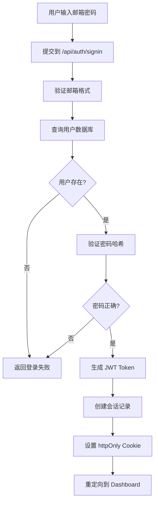
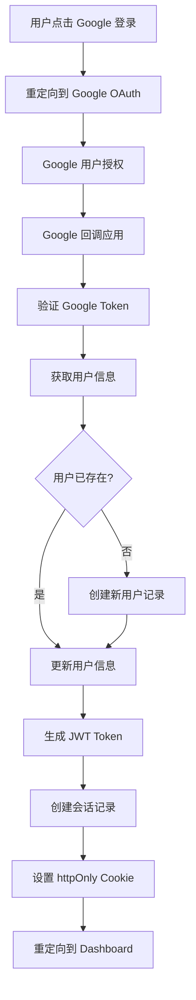

# 授权系统说明文档

## 概述

本网站采用混合身份验证系统，支持两种登录方式：

1. **传统账号密码登录**：用户注册本地账号，使用邮箱和密码登录
2. **Google OAuth 登录**：使用 Google 账号快速登录

## 技术架构

### 核心组件

- **NextAuth.js**：提供身份验证框架
- **JWT Token**：用于会话管理
- **PostgreSQL**：存储用户数据和会话信息
- **bcryptjs**：密码哈希加密

### 数据库表结构

```sql
-- 用户表
CREATE TABLE users (
  id UUID PRIMARY KEY DEFAULT gen_random_uuid(),
  email VARCHAR(255) UNIQUE NOT NULL,
  name VARCHAR(255) NOT NULL,
  password VARCHAR(255), -- 本地账号密码（Google 登录用户为空）
  provider VARCHAR(50) DEFAULT 'credentials', -- 登录方式：credentials 或 google
  created_at TIMESTAMP DEFAULT CURRENT_TIMESTAMP,
  updated_at TIMESTAMP DEFAULT CURRENT_TIMESTAMP
);

-- 会话表
CREATE TABLE user_sessions (
  id UUID PRIMARY KEY DEFAULT gen_random_uuid(),
  user_id UUID NOT NULL REFERENCES users(id),
  token VARCHAR(255) UNIQUE NOT NULL,
  expires_at TIMESTAMP NOT NULL,
  created_at TIMESTAMP DEFAULT CURRENT_TIMESTAMP
);
```

## 身份验证流程

### 1. 传统账号密码登录



### 2. Google OAuth 登录



## 会话管理

### JWT Token 结构

```javascript
{
  "id": "用户ID",
  "email": "用户邮箱",
  "name": "用户姓名",
  "provider": "登录方式",
  "iat": "签发时间",
  "exp": "过期时间"
}
```

### 会话验证

每个受保护的 API 请求都会经过以下验证步骤：

1. 从 Cookie 中提取 `session-token`
2. 从数据库查询会话记录
3. 验证会话是否过期
4. 获取用户信息
5. 将用户信息附加到请求头中

## 受保护的路由

### 前端路由保护

```typescript
// 需要登录的页面
const protectedRoutes = [
  '/dashboard',
  '/dashboard/generate',
  '/dashboard/history',
  '/dashboard/templates',
];
```

### API 路由保护

```typescript
// 需要身份验证的 API
const protectedAPIs = ['/api/generate', '/api/cover-letters', '/api/cover-letters/[id]'];
```

## 安全特性

### 1. 密码安全

- 使用 bcryptjs 进行密码哈希
- 盐值自动生成
- 不存储明文密码

### 2. 会话安全

- JWT Token 存储在 httpOnly Cookie 中
- 自动过期机制
- 会话记录数据库追踪

### 3. CSRF 保护

- NextAuth.js 内置 CSRF 保护
- 状态参数验证
- 同源策略检查

### 4. 数据验证

- 邮箱格式验证
- 密码强度要求
- 输入数据清理

## 如何获取 Google OAuth 凭据

### 步骤 1：创建 Google Cloud 项目

1. 访问 [Google Cloud Console](https://console.cloud.google.com/)
2. 点击顶部的项目选择器
3. 点击"新建项目"
4. 输入项目名称，如 "Cover Letter Generator"
5. 选择计费账户（OAuth 在免费限额内）
6. 点击"创建"

### 步骤 2：启用必要的 API

1. 在 Google Cloud Console 中，转到"API 和服务" → "库"
2. 搜索 "Google+ API" 并启用它
3. 或者搜索 "Google Identity API" 并启用（推荐用于新项目）

### 步骤 3：配置 OAuth 同意屏幕

1. 转到"API 和服务" → "OAuth 同意屏幕"
2. 选择"外部"用户类型（适用于公开应用）
3. 填写必填字段：
   - **应用名称**：AI Cover Letter Generator
   - **用户支持电子邮件**：你的联系邮箱
   - **开发者联系信息**：你的邮箱地址
4. 在"授权域"中添加你的域名：
   - 开发环境：`localhost`
   - 生产环境：`yourdomain.com`
5. 添加范围：
   - `userinfo.email`
   - `userinfo.profile`
6. 添加测试用户（开发阶段）
7. 点击"保存并继续"

### 步骤 4：创建 OAuth 2.0 客户端

1. 转到"API 和服务" → "凭据"
2. 点击"创建凭据" → "OAuth 2.0 客户端 ID"
3. 选择"Web 应用"作为应用类型
4. 输入名称："Cover Letter Generator Web Client"
5. 添加**已获授权的 JavaScript 来源**：
   - `http://localhost:3000`（开发环境）
   - `https://yourdomain.com`（生产环境）
6. 添加**已获授权的重定向 URI**：
   - `http://localhost:3000/api/auth/callback/google`（开发环境）
   - `https://yourdomain.com/api/auth/callback/google`（生产环境）
7. 点击"创建"

### 步骤 5：获取凭据

创建完成后，你会看到一个弹窗显示：

- **客户端 ID**：类似 `123456789-abcdefghijklmnop.apps.googleusercontent.com`
- **客户端密钥**：类似 `GOCSPX-abcdefghijklmnopqrstuvwxyz`

### 步骤 6：配置环境变量

将获得的凭据添加到你的 `.env.local` 文件中：

```env
GOOGLE_CLIENT_ID=123456789-abcdefghijklmnop.apps.googleusercontent.com
GOOGLE_CLIENT_SECRET=GOCSPX-abcdefghijklmnopqrstuvwxyz
```

### 步骤 7：验证配置

1. 重启开发服务器：`pnpm dev`
2. 访问登录页面：`http://localhost:3000/login`
3. 点击"Continue with Google"按钮
4. 应该会跳转到 Google 登录页面
5. 授权后应该会重定向回你的应用

## 安全最佳实践

### 1. 环境变量管理

```bash
# 开发环境
GOOGLE_CLIENT_ID=your_dev_client_id
GOOGLE_CLIENT_SECRET=your_dev_client_secret

# 生产环境
GOOGLE_CLIENT_ID=your_prod_client_id
GOOGLE_CLIENT_SECRET=your_prod_client_secret
```

### 2. 域名配置

- **开发环境**：只配置 `localhost`
- **生产环境**：只配置实际域名
- **永远不要**：在生产环境中使用开发凭据

### 3. 密钥安全

- 客户端密钥必须保密，不要提交到代码库
- 定期轮换客户端密钥
- 使用环境变量管理敏感信息
- 在 `.gitignore` 中排除 `.env` 文件

### 4. 权限控制

- 只请求必要的权限范围
- 定期审查已授权的应用
- 监控异常登录活动

## 常见问题

### Q1：Google 登录后显示"授权错误"

**解决方案**：

- 检查重定向 URI 是否正确配置
- 确保域名在 OAuth 同意屏幕中已授权
- 验证客户端 ID 和密钥是否正确

### Q2：开发环境无法使用 Google 登录

**解决方案**：

- 确保已在 OAuth 客户端中添加 `http://localhost:3000`
- 检查重定向 URI：`http://localhost:3000/api/auth/callback/google`
- 重启开发服务器

### Q3：生产环境 Google 登录失败

**解决方案**：

- 使用 HTTPS 协议
- 确保生产域名已在 Google Cloud Console 中配置
- 检查 SSL 证书是否有效

### Q4：如何切换到生产环境

1. 在 Google Cloud Console 中创建新的 OAuth 客户端
2. 配置生产环境的域名和重定向 URI
3. 更新生产环境的环境变量
4. 将 OAuth 同意屏幕发布到生产环境

## 监控和日志

### 身份验证日志

```typescript
// 登录成功
console.log('User authenticated:', {
  userId: user.id,
  email: user.email,
  provider: 'google',
});

// 登录失败
console.error('Authentication failed:', {
  email: credentials.email,
  reason: 'invalid_credentials',
});
```

### 会话监控

```typescript
// 会话创建
console.log('Session created:', {
  userId: user.id,
  sessionId: session.id,
  expiresAt: session.expires_at,
});

// 会话过期
console.log('Session expired:', {
  sessionId: session.id,
  userId: user.id,
});
```

---

## 技术支持

如果在配置过程中遇到问题，请：

1. 检查 Google Cloud Console 中的配置
2. 验证环境变量是否正确设置
3. 查看浏览器开发者工具的控制台错误
4. 检查服务器日志中的身份验证错误

更多技术细节请参考项目的 API 文档和代码注释。
